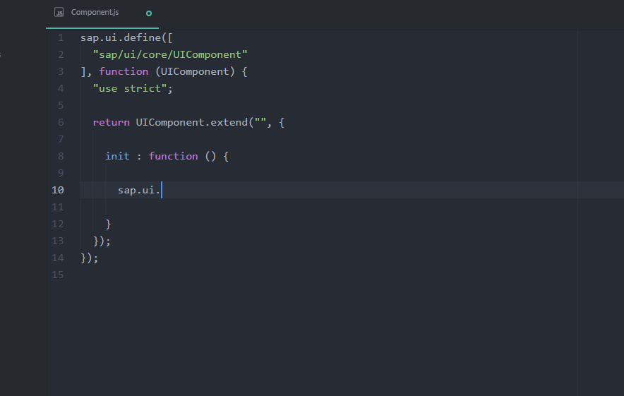

# tern-openui5

 

[tern-openui5](https://github.com/TimoSta/tern-openui5) brings autocomplete functionality for the [OpenUI5](http://openui5.org/) framework into your favorite code editor, powered by [Tern](http://ternjs.net/)

## Demo
tern-openui5 used in combination with [Atom](https://atom.io/), the hackable text editor:

## Setup
1. Install [Tern](http://ternjs.net/)
2. Copy the `openui5.js` file from this repository into the `plugin` directory of your tern installation
3. Configure tern for OpenUI5 support for your project by creating a `.tern-project` configuration file in the base directory of your project and add `openui5` to the plugins. An example `.tern-project` file could be:

        {
          "ecmaVersion": 5,
          "libs": [
            "browser",
            "jquery"
          ],
          "plugins": {
            "openui5": {}
          }
        }

### Installing Tern in Atom
Tern can be used in Atom by installing the [atom-ternjs](https://atom.io/packages/atom-ternjs) plugin.
